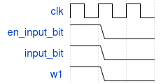
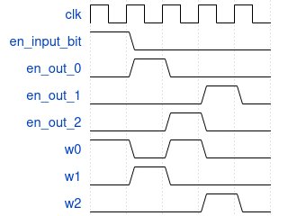

## 
Soluciones

1. Transferencia entre registros
   - a. ¿Cuales son y que representa cada entrada y cada salida del componente?¿Cuales entradas deben ser consideradas como de control? El componente tiene 4 entradas. Siendo estas w de 3 bits, en_out de 3 bits, input_bit y en_input_bit de un bit cada una. Todas son de control menos input_bit.
Cada bit de w habilita la entrada del dato al registro que lo reciba. Cada bit de en_out habilita la salida del dato del registro que lo reciba.
La entrada en_input_bit conecta la entrada input_bit al bus si tiene 1, caso contrario, lo deja en alta impedancia.
Todos los registros tienen una salida de 1 bit, conectada a la una única salida del componente (de 1 bit). Solo pueden permitir la salida de datos en un mismo clock los registros cuyas salidas de 1 bit tengan el mismo valor para que funcione correctamente y además la señal en_input_bit debe ser 0.
Denominaremos w_0, w_1, w_2 y en_out_0, en_out_1, en_out_2 a las entradas de 1 bit de cada registro para poder graficar la evolución de las entradas y salidas según lo pedido en la consigna de los siguientes items.
   - b. Secuencia de activación y desactivación de entradas
para que el registro R1 pase a tener el valor 1.
   
   
   - c. Secuencia de activaciones para que R0 inicialmente tenga un valor arbitrario, luego este valor se transferira a R1. Luego el valor de R2 pasa a R0 y finalmente de R1 a R2.
   
   

2. OrgaSmall - Análisis:
   2.1 
   - a.¿Cual es el tamaño de la memoria? La memoria tiene una capacidad de almacenar 256 palabras de 8 bits. Por lo tanto, la capacidad de la memoria es de 256 Bytes 
   - b. ¿Que tamaño tiene el PC? El PC tiene un tamaño de 1 Byte
   - c. Observando el formato de instruccion y los CodOp de la hoja de datos: ¿Cuantas instrucciones nuevas se podrıan agregar respetando el formato de instruccion?
Respetando el formato de las instrucciones, es decir, que el CodOp esta conformado por los primeros 5 bits de los 16 que contiene la instruccion, se podrian agregar únicamente 11 nuevas instrucciones. Esto se debe a que el CodOp tiene 5 bits, lo que deja un total de 32 combinaciones posibles, de las cuales 21 ya están ocupadas.

   2.2 - Módulos de Hardware
   - a. PC (Contador de Programa): ¿Que funcion cumple la señal inc? 
   La señal "inc" del PC cumple la función de aumentar en 1 al valor actual del PC. Es decir, registra la proxima instruccion.
   - b. ALU (Unidad Aritmetico Logica): ¿Que funcion cumple la señal opW?
   La señal "opW" de la ALU es una señal de control que habilita la salida de los flags resultantes de la ultima operacion hecha.
   - c. microOrgaSmall (DataPath): ¿Para que sirve la señal DE enOutImm? ¿Que parte del circuito indica que registro se va a leer y escribir?
   La señal "DE_enOutImm" sirve para habilitar el ingreso al bus de un valor inmediato dado por el decoder. Este valor representa una direccion de memoria que la unidad "Memory" se encarga de procesar (si corresponde con la señal MM_enAddr que le habilita la entrada). El Decoder es el encargado de indicar de qué registro se va a leer y en cuál se va a escribir.
   - d. ControlUnit (Unidad de control): ¿Como se resuelven los saltos condicionales? Describir el mecanismo.
   Los saltos condicionales se resuelven de la siguiente forma: según que flag es la que se desea chequear (Z, N o C) se hace el salto correspondiente (JZ, JN o JC, respectivamente). La unidad de control es la que se encarga de realizar esto. Ésta lo que hace es comparar cada flag proveniente de la ALU con la señal del salto condicional activada por la UC correspondiente a cada una, utilizando compuertas AND.  Luego, compara esas 3 salidas con una compuerta OR, y la salida de esta última se usa como entrada de control en un multiplexor. Es decir, si la UC activa algun salto asociado a una flag y la flag se activa en simultaneo entonces alguna de esas tres AND's se activara y por consecuente,la OR. En caso de que el salto condicional se tenga que realizar, este multiplexor va a sumar 2 a la direccion de la MicroOP, y en caso de que no, únicamente va a sumarle 1. Luego envía esa nueva dirección al microPC.
Observando el archivo de microCode.ops se puede observar que para cada uno de los saltos condicionales, la primera línea es activar la señal del salto condicional y cargar la microOp, y luego hay una línea de reset_microOp (que indicaría el fin de la operación), pero no termina ahí sino que continúa con 2 líneas más. Esto comprueba el análisis hecho en el párrafo anterior, ya que si el salto condicional no se realiza, se pasó a la operación siguiente y se terminó la operación. En cambio, si el salto efectivamente se realiza, se pasa a la operacion 2 líneas por debajo de la primera, y luego de activar las señales en dicha línea es que se termina la operacion.

3. Ensamblar y correr:
   - a. Antes de correr el programa, identificar el comportamiento esperado.
El programa comienza haciendo un salto hacia la etiqueta "seguir", luego guarda en los registros R0 y R1 dos valores distintos en hexadecimal, para posteriormente sumarlos, guardando el resultado de la suma en R0, hasta que la suma no produzca carry. Cuando la suma no produce carry avanza hacia "halt", entrando en un bucle y finaliza el programa  
   - b. ¿Que lugar ocupara cada instruccion en la memoria? Detallar por que valor se reemplazaran las etiquetas.

Direccion de cada instruccion:

a002 -> 0000 0000 = 0x00

f8ff -> 0000 0010 = 0x02

f911 -> 0000 0100 = 0x04

0820 -> 0000 0110 = 0x06

a806 -> 0000 1000 = 0x08

a00a -> 0000 1010 = 0x0a

En total, el programa ocupa 12 bytes en memoria

Las etiquetas se reemplazan de la siguiente manera
seguir --> 0x02, siguiente --> 0x06, halt --> 0x0A
   
   - c. Ejecutar y controlar ¿cuantos ciclos de clock son necesarios para que este codigo
llegue a la instruccion JMP halt? 
Son necesarios 52 clocks para que el codigo llegue a la instruccion "halt".
   - d. ¿Cuantas microinstrucciones son necesarias para realizar el ADD? ¿Cuantas para el
salto? 
Para el add se necesitan 5 microinstrucciones. Para el JC se necesitan 3 en caso de que se realice el salto, y 2 en caso de que no. Por ultimo el JMP necesita 2 microinstrucciones.
